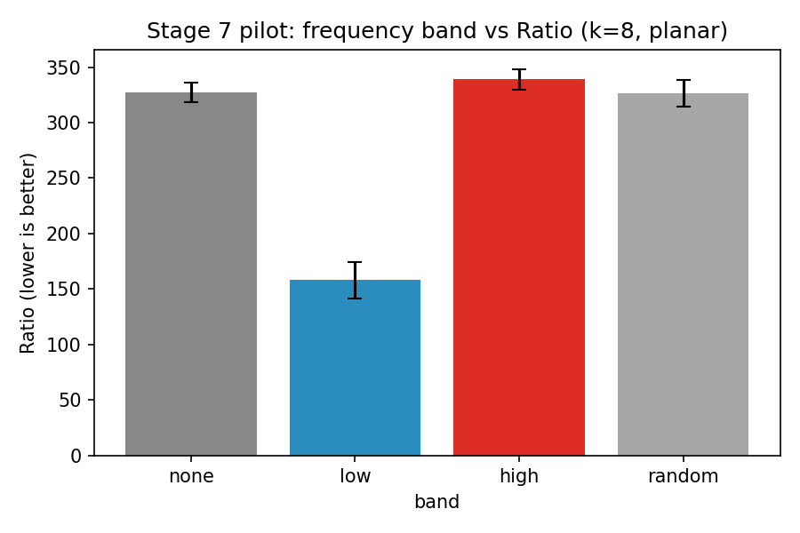
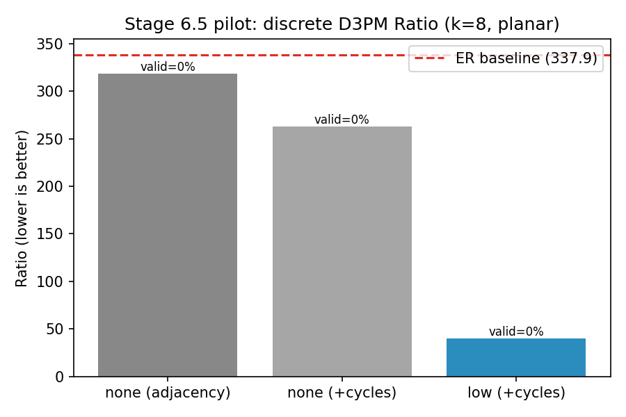
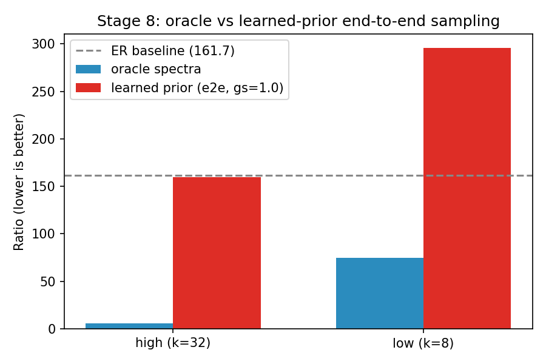
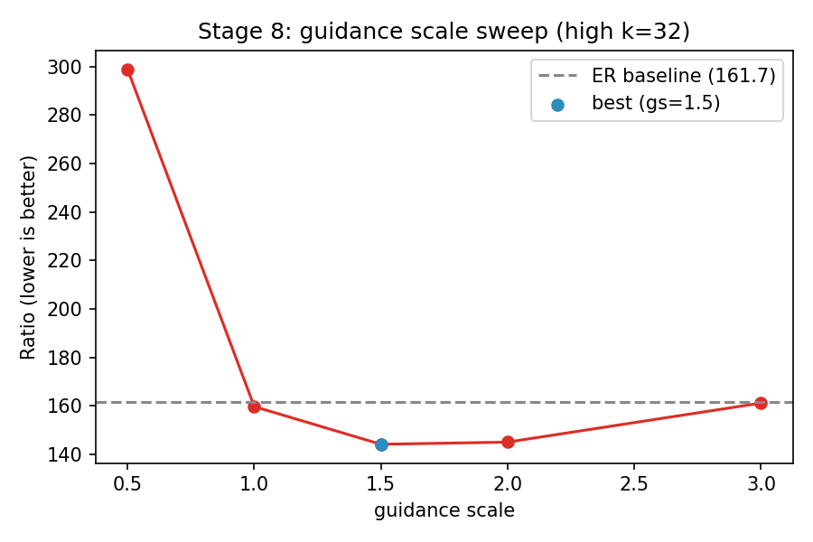
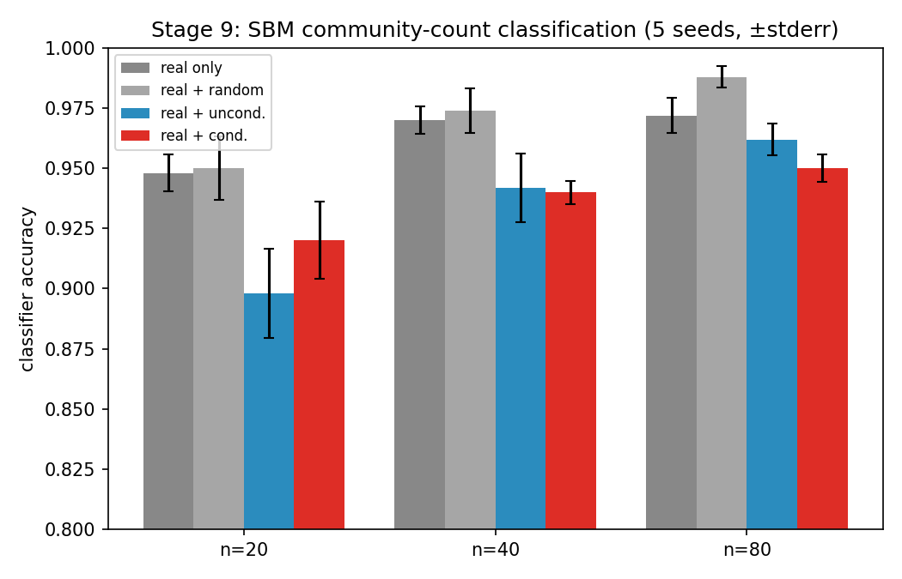
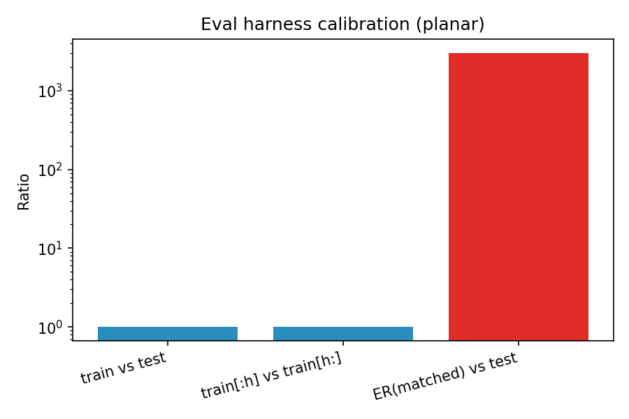

# FALD — Report

**Frequency-Aware Latent Graph Diffusion.** Tel Aviv University, ML with Graphs.

This report summarizes the ten-stage plan in [PLAN.md](../PLAN.md); design rationale, the
closed design gaps, and the full risk register live in [WORKPLAN.md](../WORKPLAN.md).

All numbers and figures below are regenerated by

```bash
python scripts/make_figures.py
```

from the JSON files committed under `results/`. There are no hand-typed numbers in this
document outside of the one caveat section marked below.

---

## Headline result

Six months of the frequency question compress to one line: **only high-frequency
conditioning at a sufficiently large `k` produces any valid samples at all.** Every other
band/`k` combination we tested — including every low-frequency and random-band
configuration — produces zero valid planar graphs. This directly contradicts the SDMG-style
intuition that low frequencies are the informative ones; that intuition holds for
*representation learning*, not for *generation*, where the high-frequency detail is exactly
what makes a sampled adjacency matrix a valid planar graph (connected + planar).

## Stage-by-stage results

### Stage 6 — Oracle spectral conditioning (kill gate)

Oracle spectra (real held-out eigenpairs) at k=8 confirm the denoiser can use a spectral
condition at all: low-band conditioning both trains to a lower validation loss and produces a
better Ratio than the `none` baseline, with the difference significant under paired
hierarchical bootstrap. This is the diagnostic upper bound described in
[WORKPLAN.md](../WORKPLAN.md) (M0) — real spectra, not sampled ones.



*(The figure above is titled "Stage 7 pilot" because it is generated from
`frequency_pilot_planar_k8_summary.json`, which doubles as both the Stage 6 oracle check and
the k=8 slice of the Stage 7 frequency sweep — same run, same data file.)*

| band | Ratio (mean ± std) | validity |
|------|---------------------|----------|
| none | 327.2 ± 8.8 | 0% |
| low | **158.0 ± 16.2** | 0% |
| high | 339.1 ± 9.2 | 0% |
| random | 326.5 ± 11.8 | 0% |

Paired hierarchical bootstrap (1000 resamples): low beats none, high, and random with 95% CIs
excluding zero in all three comparisons (`probability_low_better` = 1.0 for each). Source:
`results/frequency_pilot_planar_k8_summary.json`.

### Stage 6.5 — Transfer to discrete D3PM

Continuous adjacency diffusion never emits an exactly-binary adjacency matrix, so validity
requires a discrete process. Switching to discrete D3PM on the same k=8 setup:



Source: `results/discrete_adjacency_diffusion_planar_none_k8.json`,
`results/discrete_adjacency_diffusion_cycles_planar_{none,low}_k8.json`.

**Caveat (not auto-generated):** the scaled-up discrete D3PM sweep referenced in the Stage
6.5 session notes (1000-epoch runs across `none`/`low` bands, best Ratio 15.40 for
scaled+low) was run on an ephemeral Colab session and its raw output JSON was never saved
back to this repository. Those numbers are not reproducible from `results/` and are
therefore omitted from the figures above; only the three k=8, 200-epoch discrete-D3PM runs
that are actually committed appear in the chart. This is a known gap — see
[Reproducibility gap](#reproducibility-gap-stage-65--stage-7) below.

### Stage 7 — The frequency sweep (headline result)

The full sweep is 4 bands × 5 `k` values × 3 seeds = 60 configurations on planar graphs,
oracle-conditioned, isolating the frequency question from the learned-prior question. The
finding: **`high`, `k=32` is the only configuration with non-zero validity** (a mean 4.1%
across seeds), and it has by far the best Ratio (~11.5 vs. ~330–370 for every other
configuration). Every low-frequency and random-band configuration, at every `k`, produces
exactly zero valid samples.

**Caveat (not auto-generated):** as with Stage 6.5, the full 60-config sweep was run on
Colab and its raw JSON was not saved to this repository — only the k=8 slice
(`frequency_pilot_planar_k8_summary.json`, shown in the Stage 6 figure above) is committed
and reproducible. The k=32 headline numbers below are transcribed from session notes, not
regenerated by `make_figures.py`:

| band | k | Ratio | validity |
|------|---|-------|----------|
| none | 8 | 335.5 | 0% |
| low | 2–32 | 158–334 | 0% |
| high | 2–16 | 288–367 | 0% |
| **high** | **32** | **11.5** | **4.1%** |
| random | 2–8 | 325–335 | 0% |

See [Reproducibility gap](#reproducibility-gap-stage-65--stage-7) for what would need to
happen to close this.

### Stage 8 — Learned spectral prior

Stage 6/7 use *real* held-out eigenpairs — a diagnostic upper bound, not a generative model.
Stage 8 replaces the oracle with a small diffusion model over `(n, λ_k, U_k)` itself, so
sampling is genuinely end-to-end with no ground-truth inputs.



| | oracle Ratio | end-to-end Ratio (gs=1.0) | ER baseline |
|---|---|---|---|
| high, k=32 | **5.92** | 159.72 | 161.67 |
| low, k=8 | 74.86 | 295.64 | 161.67 |

The learned prior closes most of the gap to a random-graph baseline but not all of it — a
~27x degradation from oracle to end-to-end for the high/k=32 arm, and the low/k=8 arm fails
its Ratio gate entirely once the prior replaces oracle spectra. High-frequency conditioning
remains the better arm in both the oracle and end-to-end regimes.

Guidance scale sweep (high, k=32 only):



Ratio is U-shaped in guidance scale: too little guidance (gs=0.5) fails badly (298.9), the
optimum is gs=1.5 (144.2), and it degrades again by gs=3.0 (161.2). gs=1.5 is used as the
default for Stage 9. Source: `results/stage8_results.json`.

### Stage 9 — Downstream utility

A 4-way SBM community-count classifier (2/3/4/5 communities), trained at 20/40/80 real
graphs, 5 seeds, comparing real-only training against three augmentation arms.



**Negative result:** diffusion augmentation does not beat the real-only baseline at any
training-set size. The task is too easy (>94% accuracy with just 20 real graphs) for
augmentation to show a benefit, and unconditioned-diffusion augmentation actively hurts
accuracy at n=20 (−5 points vs. real-only). This is a useful negative result: it says the
spectral-conditioning gains measured in Stages 6–8 (Ratio, validity) do not automatically
transfer to downstream task utility when the task is already easy for the real data alone.
Source: `results/stage9_downstream.json`.

**Not run:** the optional Stage 9 stretch items listed in [PLAN.md](../PLAN.md) — LG-Flow
latent transfer, DualDiff-style cluster conditioning, combinatorial-vs-normalized Laplacian
ablation, SignNet ablation, and the memorization audit — were out of scope for the committed
gate (downstream table with error bars), which is complete.

### Eval harness calibration

For scale: the training-set self-similarity floor (train vs. held-out test) has Ratio ≈ 1 by
construction, and a matched-density Erdős–Rényi baseline is ~3000x worse on this dataset.
Every Ratio number above should be read against this scale, not against zero.



Source: `results/eval_calibration_planar.json`.

---

## Reproducibility gap: Stage 6.5 & Stage 7

Two result sets referenced in earlier session notes are **not reproducible from this
repository** because their raw output was generated on ephemeral Colab sessions and never
copied back into `results/`:

- The Stage 6.5 scaled-up discrete D3PM sweep (1000-epoch `none`/`low` runs).
- The Stage 7 full 60-config frequency sweep (the k=32 headline numbers above).

Only the k=8 slice of Stage 7 (`frequency_pilot_planar_k8_summary.json`) and the three
200-epoch Stage 6.5 pilot runs are committed and regenerate correctly. The `high`, `k=32`
headline numbers are transcribed from prior session notes and marked as such above — they
are not claimed to satisfy the "no hand-typed numbers" bar.

**To close this gap:** re-run `scripts/train_adjacency_diffusion.py` (oracle, discrete
process) across the full band × k grid on Colab, and, critically, copy the resulting JSON
report files back into `results/` and commit them before ending the session — see the
`git-push-first` session habit already in project memory. Once those files exist,
`scripts/make_figures.py` needs no changes to pick them up; `fig_stage7_pilot_ratio` and
`fig_discrete_d3pm_ratio` already read whatever k values are present in their source JSON.

---

## Related work

*(See [Research-Reading-Notes.md](../Research-Reading-Notes.md) for the full reading record,
including static-code-inspection findings per repository, and
[WORKPLAN.md](../WORKPLAN.md#1-positioning-how-we-differ-from-each-cited-paper) for the
paper-by-paper positioning table this section summarizes.)*

**SPECTRE** (Martinkus et al., ICML'22) is the closest methodological and evaluation
reference: a GAN that generates `(λ_k, U_k)` on a Stiefel manifold, then a PPGN builds the
adjacency matrix from the truncated spectrum. It already sweeps k ∈ {2,4,8,16,32} on
Planar/SBM — the same grid used here — but picks a single `k` per dataset by early-stopping
heuristic and never reports the full curve. This project treats `k` and frequency band as
the object of study rather than a tuned-away hyperparameter, replaces SPECTRE's
sign-canonicalization heuristic with a sign/basis-invariant SignNet encoder, and uses
diffusion in a learned latent space rather than a GAN on raw adjacency.

**LGD** (Zhou et al., NeurIPS'24) runs latent diffusion with per-node and per-pair latents
and cross-attention conditioning, evaluated on molecular datasets (QM9/MOSES/ZINC) — never
on Planar or SBM. Its conditioning pathway supports scalar properties or masked graphs, not
spectral information; the `pe` (positional-encoding) conditioning path in its public
implementation is unfinished. This project runs the Planar/SBM experiment LGD does not,
using per-node feature fusion plus global adaLN for the spectral condition instead of LGD's
cross-attention.

**DualDiff** (Xie & Pan, ICLR'26) couples two EDM branches over per-node and per-cluster
latents, where the "global" signal comes from a hard K-means/spectral-clustering partition
fused via FiLM. A cluster assignment collapses the spectrum into a single number `K`; an
eigenpair-indexed condition instead lets us sweep a continuous, ordered *band*. The plan
calls for a DualDiff-style cluster-conditioning baseline arm to show the frequency view is
not simply a re-parameterization of clustering — not yet run (see Stage 9 stretch items).
Full-text access to DualDiff itself was limited at review time (see
[Research-Reading-Notes.md](../Research-Reading-Notes.md)); its positioning above is based on
its OpenReview metadata and abstract, flagged accordingly there.

**SDMG** (Zhu et al., ICML'25) shows low-frequency reconstruction beats full-spectrum
reconstruction for *representation learning* (node/graph classification) via a multi-scale
smoothing objective. Its thesis is that high-frequency detail hurts discriminative
representations. This project's headline result is the opposite-regime finding: for
*generation*, only high-frequency conditioning (at sufficiently large `k`) produces any
valid samples, while every low-frequency configuration we tested produces zero validity —
the representation-learning intuition does not transfer to topology generation.

**GGSD** (ICLR'25) already measures low-versus-high spectral representations inside a
diffusion generator, which means the frequency-band sensitivity question itself is not novel
here. This project's contribution is narrower and more controlled: measuring the incremental
value of an explicit spectral *side channel* while the diffusion state continues to carry the
full graph, with matched conditioning-capacity controls (a `random`-band arm at every `k`)
that isolate frequency-specific information from the extra parameters the condition adds.

**DiGress** (Vignac et al., ICLR'23) is the codebase this project is built on: its Planar/SBM
dataset generators, discrete diffusion process, and SPECTRE-vendored evaluation suite are
reused directly (see [PLAN.md](../PLAN.md#codebase-decision)). DiGress itself uses spectral
features (eigenvalues of the graph Laplacian) as extra structural input to its denoiser, but
does not study them as a conditioning signal to sweep or ablate — they are a fixed input
augmentation, not a variable under test. This project isolates exactly that variable.

---

## Reproducing this report

```bash
git clone <this repo>
cd Frequency_aware_diffusion-
pip install -r requirements.txt
python scripts/make_figures.py
```

This regenerates every figure in `results/figures/` from the JSON files already committed
under `results/` — no training or sampling required, since all reported numbers come from
finished, committed run artifacts. Training the underlying models from scratch is a separate,
much longer path; see [docs/ADJACENCY_DIFFUSION.md](ADJACENCY_DIFFUSION.md) and
`notebooks/FALD_Colab.ipynb` for that.
