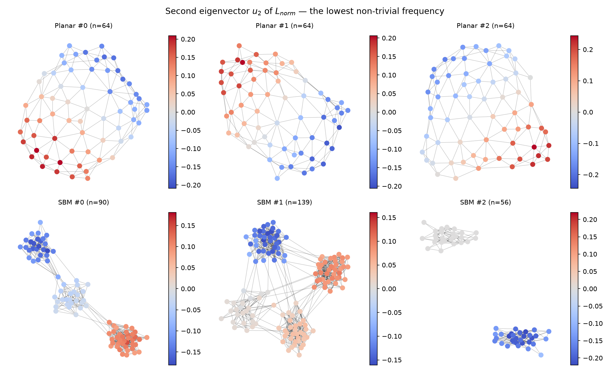

# Spectral utilities and SignNet (`fald/data/spectral.py`, `fald/models/signnet.py`)

Everything downstream reads the spectrum through these functions, so an off-by-one in the band
indexing or a sign convention error would silently corrupt the headline result instead of
crashing. Hence Stage 3's gate is a set of checks with model-independent known answers.

## Choices, and why

**`L_norm = I − D^{−1/2} A D^{−1/2}`, never `L = D − A`** (WORKPLAN G6). The combinatorial
Laplacian folds degree — a local property — into its low-frequency components, and its
eigenvalues are not comparable across graph sizes. `L_norm` is bounded in `[0, 2]`.

**The trivial eigenpair is always dropped.** `λ₁ = 0` with `u₁ ∝ D^{1/2}1` carries only degree
information, so keeping it would leak a local statistic into every band. Index 0 is never
eligible for selection, which the gate asserts directly.

**Dense `scipy.linalg.eigh`, not a sparse solver.** `n ≤ 200` here, the `high` band needs the
top of the spectrum anyway, and a dense symmetric solve is both faster and more numerically
trustworthy at this size. Observed residual `‖Lu − λu‖∞ ≈ 1.2e-15`.

**All arms are dimension-matched by construction.** Every band returns a `(k,)` eigenvalue
vector and an `(n, k)` eigenvector matrix, so the only difference between `low`, `high`,
`random` and `gaussian` is *which* eigenpairs are selected. This is what makes the frequency
claim falsifiable rather than a statement about parameter count (WORKPLAN G4).

## Bands

| Arm | `C_k` |
|---|---|
| `low` | `(λ₂..λ_{k+1}, u₂..u_{k+1})` — the headline arm |
| `high` | `(λ_{n−k+1}..λ_n, u_{n−k+1}..u_n)` |
| `random` | `k` eigenpairs sampled without replacement from indices `2..n` |
| `gaussian` | `k` random scalars and an `N(0,1)` matrix in `R^{n×k}` — strictest control, identical shape, zero structural information |
| `cluster` | DualDiff-style hard partition, one-hot `(n, K)` via spectral clustering. A *baseline*, not a band: it collapses the spectrum into one integer `K` |
| `none` | empty |

## SignNet

`ψ = ρ([φ(u_j) + φ(−u_j)]_j)`, with `φ` acting on `(u_j[i], λ_j)` per node per eigenvector.

Sign invariance is structural, not learned: `φ(u) + φ(−u)` is symmetric in the sign of `u`, so
flipping any column cannot change the output. The gate measures a deviation of exactly
`0.00e+00` — bitwise identical, not merely within tolerance. SPECTRE's alternative (force the
max-magnitude entry positive) is discontinuous.

**Correction:** SignNet is not invariant to arbitrary rotations inside a repeated eigenspace.
That requires BasisNet or projector features such as `U_g U_gᵀ`. The existing gate proves sign
invariance only; it does not close the basis-ambiguity half of WORKPLAN G3. The new primary
adjacency-diffusion path consumes `U_k diag(λ_k) U_kᵀ`, which is basis-invariant within an exactly
repeated eigenspace. Any later path that consumes columns separately must add the missing rotation
test.

`φ` never sees a node index, so the encoder is permutation equivariant (measured `3e-08`,
float32 rounding). Outputs are concatenated over `j` rather than summed, because the frequency
index is meaningful and ordered — summing would discard exactly the structure being measured.

`random_sign_flip` is available as training augmentation: a secondary defence so no
*downstream* component quietly learns a sign convention.

## Caching

`cached_eigendecompositions` memoizes to `data/cache/` as compressed `.npz`. The spectrum of a
training graph never changes, so recomputing it every epoch is a large silent cost. The cache
key hashes the exact adjacency bytes in the node order used by the eigenvector rows. An earlier
Weisfeiler–Lehman key was isomorphism-invariant and could therefore return eigenvectors in the
wrong row order for a permuted copy of the same graph. Verified to round-trip bit-exactly.

## Gate

```
python scripts/spectral_sanity.py
```

| Check | Result (32 Planar + 32 SBM graphs) |
|---|---|
| `‖Lu − λu‖∞` | 1.2e-15 |
| `λ ∈ [0, 2]` | violated by ≤ 8.9e-16 |
| zero-eigenvalue multiplicity = component count | 0 mismatches |
| `‖L_norm (D^{1/2}1)‖` | 2.2e-16 |
| `u₁ ∝ D^{1/2}1` on connected graphs | deviation 3.3e-16 |
| band indices, low/high ordering, dimension match | pass |
| SignNet under per-column and full sign flips | **0.00e+00** |
| SignNet under node permutation | 3.0e-08 |
| eigendecomposition cache round-trip | exact |



The figure is the one that makes the hypothesis legible. On Planar, `u₂` is a smooth spatial
gradient across the layout. On SBM it splits the graph into its communities — precisely the
global structure we claim low-frequency conditioning supplies.

## Disconnected graphs: resolved

**Status: fixed.** `select_band` offsets the band by the number of zero eigenvalues rather than
a hardcoded 1, so no arm can ever contain a constant direction.

This matters because 3 of 128 SBM training graphs (2.3%) are disconnected. With `c` components
`L_norm` has `c` zero eigenvalues whose eigenvectors are component indicators, carrying no
frequency information. Dropping only the first leaves `c−1` of them inside the band — at `k=2`
on a 2-component graph, half the conditioning budget. Because extra zero eigenvalues sit at the
*bottom* of the spectrum, this pollutes the `low` arm and leaves `high` untouched, biasing
precisely the low-versus-high comparison that is the headline claim.

Disconnection is not a data defect. With blocks of ~25–31 nodes and `p_inter ≈ 0.003` only about
2 edges are expected between a given pair of blocks, so occasionally getting zero is ordinary
chance — which also means generated samples will show it.

### What prior work does

| Codebase | Behaviour |
|---|---|
| **SPECTRE** (`data.py`) | `eigvals = eigvals[1:]` / `eigvecs = eigvecs[:, 1:]` — drops exactly one, hardcoded, no component check. **Has this flaw.** |
| **DiGress** (`extra_features.py`) | `indices = arange(k) + n_connected_components` — offsets by the component count. Also feeds `c` as a global feature and a per-node "outside the largest connected component" indicator. |

We follow DiGress. Measured on the real 2-component SBM graph (n=56), `k=8`:

| | selected indices | smallest eigenvalue in band | wasted slots |
|---|---|---|---|
| ours (offset by `c`) | `[2..9]` | 4.88e-01 | 0 |
| SPECTRE-style (`[1:]`) | `[1..8]` | 2.44e-15 | 1 |

`SpectralCondition.n_components` exposes the count so downstream models can use it as a feature
the way DiGress does. `count_trivial_eigenpairs` uses a `1e-8` threshold: true zero eigenvalues
land at ~1e-15, while a connected graph's `λ₂` is small but never that small. `select_band`
also accepts `n_trivial` explicitly if you would rather pass a structurally computed count.

Planar is unaffected — all 128 training graphs are connected.

## Original caveat as found by the gate

1 of 32 sampled SBM training graphs is disconnected (SBM #2 in the figure). This matters more
than the count suggests:

* With `c` components the null space of `L_norm` is `c`-dimensional, so `λ₁ = … = λ_c = 0` and
  `u₁` is an **arbitrary basis vector of that space** rather than `D^{1/2}1`. An earlier version
  of the gate asserted `u₁ ∝ D^{1/2}1` unconditionally and failed at 3.8e-01 on this graph. The
  test was wrong, not the code: `D^{1/2}1` is still *in* the null space (`‖Lv‖ = 1.4e-16`). The
  gate now asserts the invariant that always holds, and the stronger alignment claim only for
  connected graphs.
* Consequently, "drop the first eigenpair" removes only *one* of `c` trivial directions. For a
  disconnected graph the `low` band's leading eigenvectors encode **component membership, not
  community structure** — visible in the figure, where SBM #2's `u₂` puts one entire component
  at ≈0 and shows no within-component structure.

This was a real confound for SBM low-band conditioning, not a cosmetic issue: for those graphs
the conditioning signal answered a different question than it does for connected graphs.
Resolved by offsetting the band by `c` — see "Disconnected graphs: resolved" above. Dropping the
affected graphs was the alternative, and was rejected because it would change the dataset
(breaking comparability with SPECTRE's and DiGress's published SBM numbers) and would not help
at generation time, where the model emits disconnected graphs regardless.
